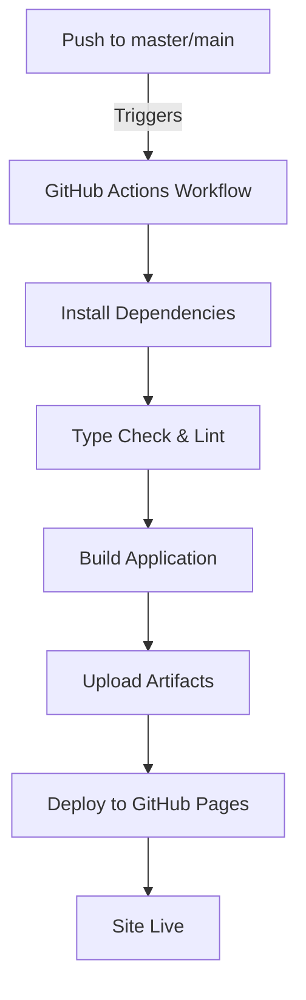

# LMDpro - GitHub Pages Deployment Guide

## 🚀 Auto-Deployment Setup

Your project now has automatic deployment configured. Every push to `master` or `main` branch will trigger automatic deployment to GitHub Pages.

---

## 📋 Quick Start

### Step 1: Enable GitHub Pages
1. Go to your repository: https://github.com/LMD-Academy/LMDpro
2. Navigate to **Settings → Pages**
3. Under "Build and deployment":
   - Source: **GitHub Actions** (should be auto-selected)
4. Save settings

### Step 2: Push Code
```bash
# Make sure all changes are committed
git add .
git commit -m "feat: Auto-deployment to GitHub Pages"
git push origin master
```

### Step 3: Monitor Deployment
1. Go to **Actions** tab in GitHub
2. Watch the deployment workflow
3. Once complete, your site is live!

---

## 🔗 Access Your Deployed Site

After first deployment:
```
https://lmd-academy.github.io/LMDpro/
```

Check the **Deployments** section in your repository for the live URL.

---

## ✅ Deployment Checklist

- [ ] GitHub Pages enabled in Settings
- [ ] Branch protection rules configured (optional)
- [ ] Secrets added (if needed for environment variables)
- [ ] First push completed
- [ ] Workflow runs successfully
- [ ] Site accessible at GitHub Pages URL
- [ ] All features working

---

## 🔄 How Auto-Deployment Works



### Workflow Steps:
1. **Checkout** - Gets your code
2. **Setup Node.js** - Installs Node environment
3. **Install** - Downloads npm packages
4. **Type Check** - Validates TypeScript
5. **Lint** - Checks code quality
6. **Build** - Creates optimized production build
7. **Upload** - Sends files to GitHub
8. **Deploy** - Makes site live

---

## 📊 Deployment Status

Check deployment status:
- Go to repository → **Actions** tab
- View workflow runs
- Click workflow to see details
- Green ✅ = Success, Red ❌ = Failed

---

## 🐛 Troubleshooting

### Issue: Workflow Fails
**Solution:**
1. Check error message in Actions tab
2. Review build logs
3. Fix issues locally first
4. Commit and push again

### Issue: Site Not Updating
**Solution:**
1. Hard refresh browser (Ctrl+Shift+R)
2. Check GitHub Pages URL
3. Wait 2-3 minutes for deployment
4. Verify workflow completed successfully

### Issue: Environment Variables Not Working
**Solution:**
- Next.js public variables only in production
- Must start with `NEXT_PUBLIC_`
- Restart workflow after adding

---

## 🔐 Managing Secrets

If you need to add environment variables:

1. Go to **Settings → Secrets and variables → Actions**
2. Click **New repository secret**
3. Add variables needed for deployment
4. Reference in workflow: `${{ secrets.YOUR_SECRET }}`

---

## 📈 Monitoring Deployments

### View Deployment History
```
Repository → Deployments → View all deployments
```

### Check Workflow Runs
```
Repository → Actions → Select workflow → View runs
```

### Access Logs
```
Actions → Latest run → Click job → View logs
```

---

## 🎯 Next Steps

1. **Test Locally First**
   ```bash
   npm run dev
   npm run build
   npm run start
   ```

2. **Commit Changes**
   ```bash
   git add .
   git commit -m "Ready for deployment"
   git push origin master
   ```

3. **Monitor Workflow**
   - Watch Actions tab
   - Wait for green checkmark

4. **Verify Deployment**
   - Visit GitHub Pages URL
   - Test all features
   - Check performance

---

## 📚 Additional Resources

- [GitHub Pages Documentation](https://docs.github.com/en/pages)
- [GitHub Actions Documentation](https://docs.github.com/en/actions)
- [Next.js Deployment](https://nextjs.org/docs/deployment)
- [Static Export Guide](https://nextjs.org/docs/advanced-features/static-html-export)

---

## 🎉 You're All Set!

Your LMDpro application is now set up for automatic deployment to GitHub Pages. Every commit to the master branch will automatically build and deploy your application.

**Status: ✅ AUTO-DEPLOYMENT ACTIVE**

For issues or questions, check the Actions tab or review deployment logs.
