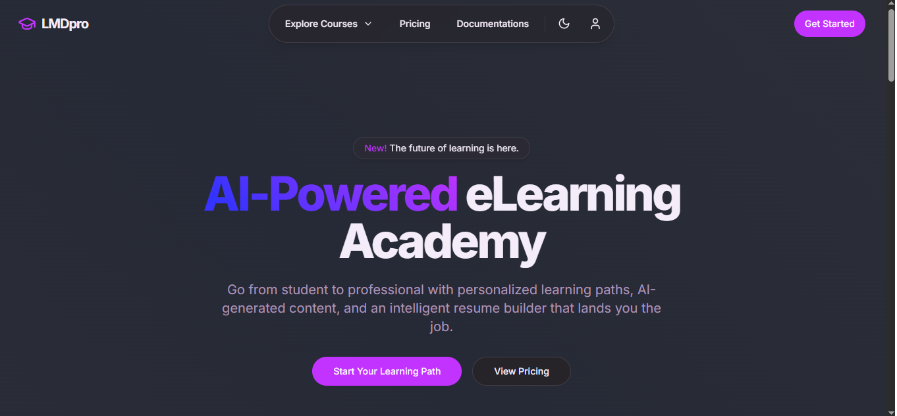
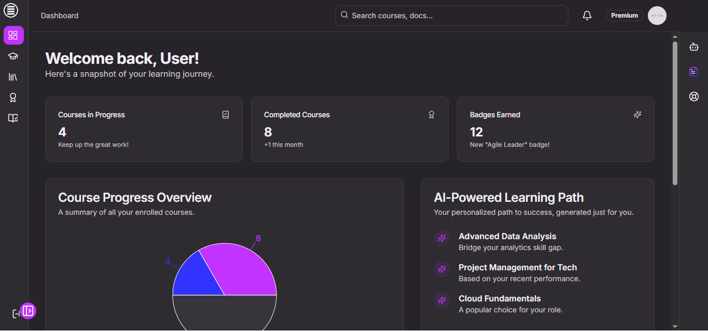
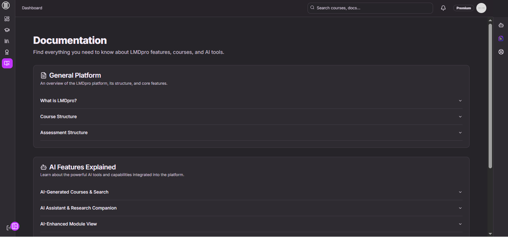

# 🚀 LMDpro - AI-Powered Leadership & Management Development Platform

[](https://semver.org)
[](https://nodejs.org)
[](https://opensource.org/licenses/MIT)
[](http://makeapullrequest.com)

**LMDpro** is a cutting-edge, enterprise-grade SaaS platform that revolutionizes leadership and management development through artificial intelligence. Our platform combines advanced machine learning algorithms, real-time collaboration tools, and personalized learning experiences to accelerate professional growth and organizational excellence.

**Homepage:**


    *The clean and modern landing page for LMDpro.*

## 🌟 Key Features

### 🔐 **Enterprise Security**
- **Google OAuth 2.0 Integration**: Secure, streamlined authentication
- **JWT Token Management**: Stateless, scalable session handling
- **Rate Limiting & CORS Protection**: Advanced security measures
- **Helmet.js Security Headers**: Enhanced protection against vulnerabilities

### 🤖 **AI-Powered Intelligence**
- **Autonomous AI Agents**: Multi-agent collaboration system
- **Real-Time Communication**: WebSocket-powered instant messaging
- **Intelligent Task Management**: AI-driven performance optimization
- **Natural Language Processing**: Advanced conversation capabilities

### 📚 **Learning & Development**
- **Interactive Podcast Library**: Curated leadership content
- **Adaptive Learning Paths**: Personalized development journeys
- **Progress Analytics**: Data-driven insights and recommendations
- **Multi-Language Support**: Global accessibility with RTL support

### 🎨 **User Experience Excellence**
- **Material Design 3.0**: Modern, accessible interface
- **Dark/Light Theme**: Adaptive UI with user preferences
- **Arabic Language Support**: Almarai font integration
- **Responsive Design**: Seamless experience across all devices
- **Progressive Web App**: Offline capabilities and native-like performance

## Screenshots

-   **Dashboard:**
    
    *The clean and modern Dashboard page for LMDpro.*    

-   **Course Catalog:**
    
    *Browse the extensive catalog of courses with advanced filtering.*

## 🏗️ Technical Architecture

### **Frontend Stack**
```
├── React 18.3.1          # Modern React with Concurrent Features
├── Material-UI 5.15.15    # Component Library & Design System
├── Vite 5.2.11           # Ultra-fast build tool
├── React Router 6.23.1    # Client-side routing
├── Emotion 11.11.x        # CSS-in-JS styling
└── Socket.IO 4.7.5        # Real-time communication
```

### **Backend Stack**
```
├── Node.js 18+           # JavaScript runtime
├── Express 4.19.2        # Web application framework
├── MongoDB 8.4.1         # NoSQL database
├── Socket.IO 4.7.5       # WebSocket implementation
├── Winston 3.13.0        # Advanced logging
└── Helmet 7.1.0          # Security middleware
```

### **AI & Machine Learning**
```
├── OpenAI GPT-4          # Language model integration
├── LangChain 0.2.3       # LLM application framework
├── Google Cloud AI       # Translation & Text-to-Speech
└── Custom AI Agents      # Proprietary intelligence layer
```

### **Cloud Infrastructure**
```
├── AWS Elastic Beanstalk # Scalable application hosting
├── MongoDB Atlas         # Managed database service
├── CloudFront CDN        # Global content delivery
└── Route 53 DNS          # Domain management
```

## Installation

### Prerequisites
- Node.js v18.x and npm v8.x
- MongoDB instance (Local or Cloud)
- Google Cloud Console configured for OAuth

### Getting Started

Follow these steps to set up and run LMDpro locally.

### 🛠️ Clone the Repository

```bash
git clone https://github.com/yourusername/lmdpro.git
cd lmdpro
```

### 📦 Installation

#### Install Client Dependencies

```bash
cd client
npm install
```

#### Install Server Dependencies

```bash
cd ../server
npm install
```

### 🚀 Running Locally

Run both client and server concurrently.

```bash
npm run dev
```

### 🧪 Automated Testing

Ensure a robust application by running tests.

#### Running Tests

```bash
cd server
npm test
```

### 🌍 Deployment

Deploy LMDpro to the cloud with AWS Elastic Beanstalk.

Ensure you have the AWS Elastic Beanstalk CLI installed and configured.

```bash
npm run deploy
```

## 📈 SEO Optimization

LMDpro is built with SEO in mind to ensure high visibility in search engines. Here are some of our focus keywords:

- Leadership Development
- AI Management Solutions
- AI-Powered Learning
- Professional Growth
- AI Agents Collaboration

## 📝 License

LMDpro is licensed under the [MIT License](LICENSE). Please see the LICENSE file for more information.

## 🤝 Contributing

Contributions, issues, and feature requests are welcome! Feel free to check out the [issues page](https://github.com/yourusername/lmdpro/issues).

-   **Course Docs:**
    
